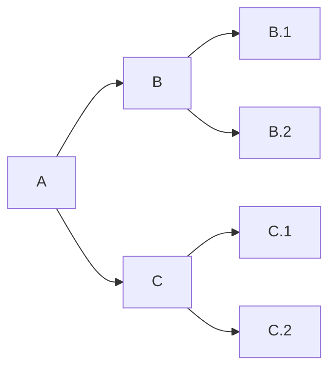

# Contributing Guidelines

We will not make any modifications to the code in principle. We only pull the content of the upstream project to release and upload artifacts.

## General

Please make sure that there aren't existing pull requests attempting to address the issue mentioned. Likewise, please check for issues related to update, as someone else may be working on the issue in a branch or fork.

- Please open a discussion in a new issue/existing issue to talk about the changes you'd like to bring
- Develop in a contributor's branch, not main/product
- Each issue must be submitted for a pull_request

When creating a new branch, prefix it with type of change, the associated opened issue number and some text describing the issue (using dash as a separator).

For example, if you work on a bugfix for the issue #361, you could name the branch `bug361-container-startup-repair`

> Type must be one of the following:

- **enhancement**: A new feature
- **bug**: A bug fix
- **documentation**: Documentation only changes

## Structure

Plugin-navigator perform file operations normally by some system packages such as file and zip.

> Please refer to the [Dependencies](./docs/code_owner.md) for details

## Branch

This repository have these branchs:

- **Contributor's branch**: Develpoer can fork main branch as their delelopment branch anytime
- **main branch**: The only branch that accepts PR from Contributors's branch
- **production branch**: For version release and don't permit modify directly, only merge PR from **main branch**

Flow: Contributor's branch → main branch → production branch

#### what is pull request

[Pull request](https://docs.github.com/pull-requests) let you tell others about changes you've pushed to a branch in a repository on GitHub.

#### When is PR produced?

- Contributor commit to main branch
- main branch commit to production branch

#### How to deal with PR?

1. [pull request reviews](https://docs.github.com/en/pull-requests/collaborating-with-pull-requests/reviewing-changes-in-pull-requests/about-pull-request-reviews)
2. Merge RP and CI/CD for it

## DevOps principle

DevOps thinks the same way **[5m1e](https://www.dgmfmoldclamps.com/what-is-5m1e-in-injection-molding-industry/)** for manufacturing companies

We follow the development principle of minimization, rapid release

### Version

Version is connect by [navigator.json](../navigator.json), it will be synchronized by the version of [upstream project](https://github.com/45Drives/cockpit-navigator). DevOps is also triggered by modifying this version of the file.

### Artifact

Websoft9 use below [Artifact](https://jfrog.com/devops-tools/article/what-is-a-software-artifact/) for different usage:

- **Azure Storage for files**: Access [packages list](https://artifact.azureedge.net/release?restype=container&comp=list) at [Azure Storage](https://learn.microsoft.com/en-us/azure/storage/storage-dotnet-how-to-use-blobs#list-the-blobs-in-a-container)

### WorkFlow

Websoft9 use the [Production branch with GitLab flow](https://cm-gitlab.stanford.edu/help/workflow/gitlab_flow.md#production-branch-with-gitlab-flow) for development collaboration

## licensing

See the [LICENSE](https://github.com/Websoft9/docker-library/blob/main/LICENSE.md) file for our project's licensing. We will ask you to confirm the licensing of your contribution.

We may ask you to sign a [Contributor License Agreement (CLA)](http://en.wikipedia.org/wiki/Contributor_License_Agreement) for larger changes.
