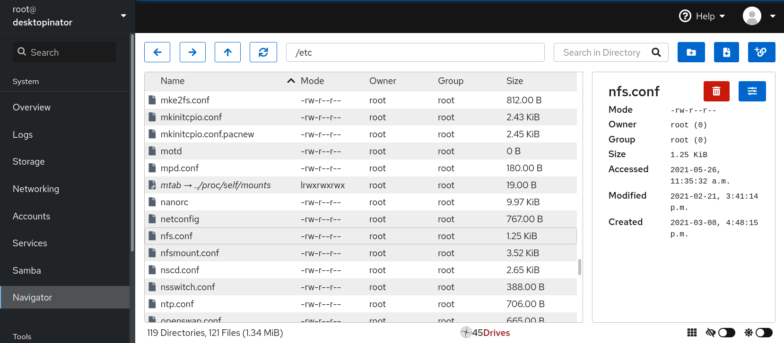
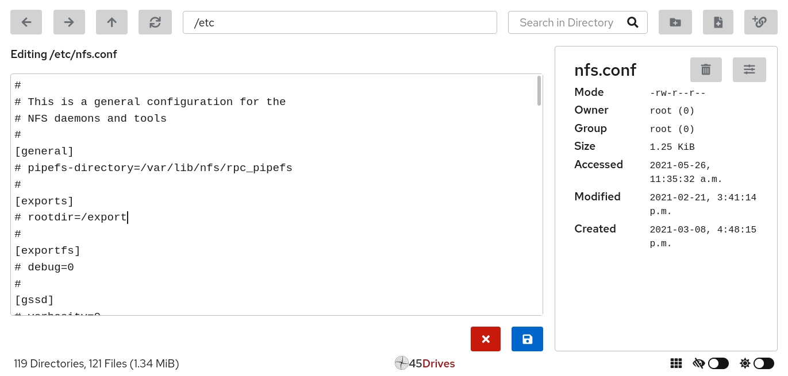
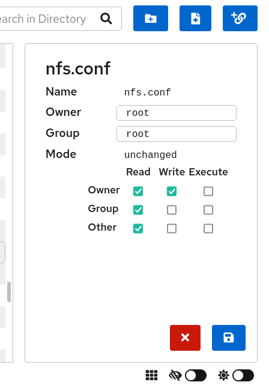

[](http://www.gnu.org/licenses/gpl-3.0)
[](https://github.com/Websoft9/plugin-navigator)
[](https://github.com/Websoft9/plugin-navigator)
[](https://github.com/Websoft9/plugin-navigator)

# Websoft9 Plugin - `navigator`

This repository is fork from [cockpit-navigator](https://github.com/45Drives/cockpit-navigator.git) which is a file System Browser for Cockpit-remotely browse, manage, edit, upload, and download files on your server through your web browser.

## Features

With no command line use needed, you can:

- Navigate the entire filesystem,
- Create, delete, and rename files,
- Edit file contents,
- Edit file ownership and permissions,
- Create symbolic links to files and directories,
- Reorganize files through cut, copy, and paste,
- **Upload files by dragging and dropping**,
- **Download files and directories**.

| Browsing Filesystem                      |
| ---------------------------------------- |
|  |

| Editing Content                           | Editing Properties                          |
| ----------------------------------------- | ------------------------------------------- |
|  |  |

## Install and Upgrade

This plugin is a part of [Websoft9](https://github.com/Websoft9/websoft9) which is a web-based PaaS platform by default. If you have [install Websoft9](https://github.com/Websoft9/websoft9) you can use this plugin directly.  

If there no this plugin at Websoft9, you can install or upgrade it by below command:  

```
cd /usr/share/cockpit
wget https://artifact.azureedge.net/release/websoft9/plugin/navigator/navigator-latest.zip
unzip navigator-latest.zip && rm -f navigator-latest.zip
```

## How to contribute it?

We greatly welcome community contributions to provide suggestions and improvements to our project:

1. Reporting bugs
   If you find a bug, please tell us so we can triage it. All bugs are managed in this [GitHub repo](https://github.com/45Drives/cockpit-navigator/issues/new/choose). 

2. Feature requests
   You can request new features in this [GitHub repo](https://github.com/Websoft9/plugin-navigator/issues/new?assignees=&labels=enhancement&projects=&template=feature_request.md&title=enhancement+title+for+%5Bappname%5D). 

3. Contributing to the Library codebase, some times will have reward for it  
   Please follow our [build instructions](./docs/developer.md) and [contribution guidelines](CONTRBUTING.md) when making a contribution.


## License

**plugin-navigator** is maintained by [Websoft9](https://www.websoft9.com) and released under the GPL3 license.
